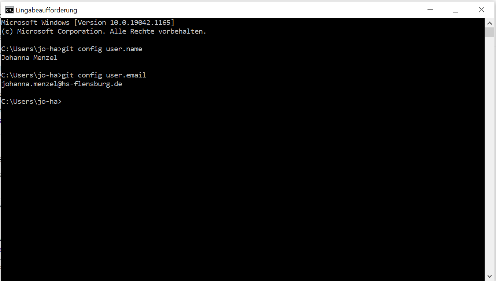
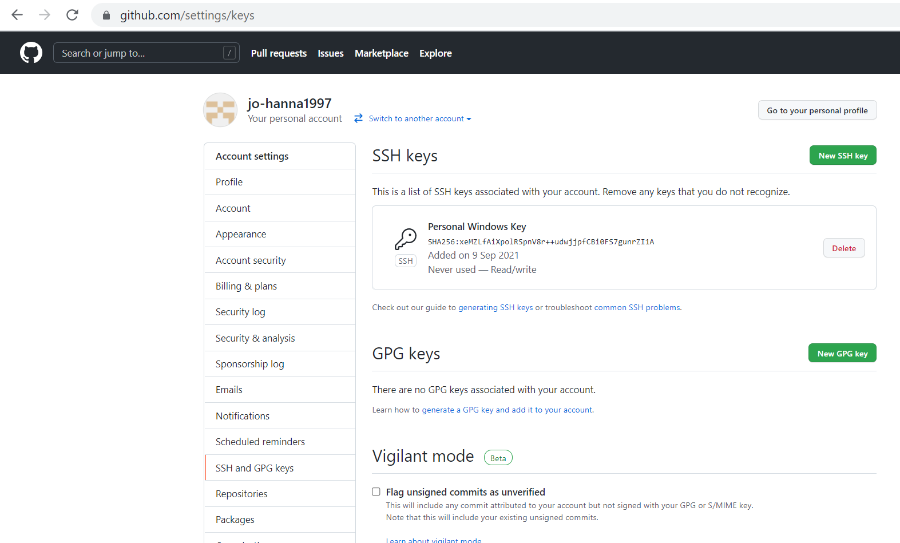

# 0. Übung zur Vorlesung Algorithmen

Diese Übung soll Ihnen dabei helfen den Ablauf beim Bearbeiten und Abgeben der Übungen kennenzulernen.
Für alle folgenden Übungen ist es notwendig, den Ablauf zu kennen und zu beherschen. 
Nutzen Sie diese Woche, um sich mit all den techisch-organisatorischen Gegebenheiten vertraut zu machen.
Bitte lesen Sie zur Bearbeitung der Aufgaben hier nach: https://hs-flensburg-algo.github.io/tutorials/ 

Prüfen Sie am Ende, ob Sie die folgenden Ziele erreicht haben:
- Sie haben bei GitHub Ihre E-Mail-Adresse und Ihren Namen gesetzt.
- Sie haben sich ein SSH-Schlüsselpaar generiert und den _public key_ bei GitHub hinterlegt.
- Sie wissen, wie Sie das _git repository_ einer Aufgabe mittels SSH auf Ihren Rechner klonen können, um die Aufgabe lokal zu bearbeiten.
- Sie wissen:  
                - wie Sie mit `git status` sehen, welche Dateien Sie verändert haben \
                - wie Sie mit `git add <file-path>` Dateien für die Abgabe auswählen können \
                - wie Sie mit `git status` unter _Changes to be comitted_ sehen können, ob Sie alle gewünschten Dateien ausgewählt haben \
                - wie Sie mit `git commit -m "Hier eine SINNVOLLE Commit-Nachricht schreiben"` umgehen \
                - wie Sie mit `git push` Ihre Abgabe hochladen 
- Sie haben die Code-Formatter in Eclipse eingestellt. Ordentlich und nach Vorgaben formatierter Code ist nicht optional, sondern essentiell. Dies wird auch getestet.
- Sie wissen, wie Sie das _git repository_ einer Aufgabe in Eclipse importiern können.
- Sie wissen, wie Sie mit den bereitgestellten JUnit-Tests Ihre Implementierung/Abgabe testen können. Sie können die JUnit-Tests also ausführen. Vor einer Abgabe müssen grundsätzlich immer **alle** JUnit-Tests erfolgreich durchlaufen. 
- Sie können Anmerkungen zu Ihrem automatisch erstellten _pull request_ einsehen und darauf reagieren.

## 1 - Git-Name und -Email

Stellen Sie sicher, dass Sie Ihre E-Mail-Adresse und Ihren Namen in der `git config` eingetragen haben.
Um zu kontrollieren, dass alles geklappt hat, geben Sie in Ihrer Konsole `git config user.name` und `git config user.email` ein und machen Sie davon einen Screenshot.
Klonen Sie dafür dieses _git repository_.
Speichern Sie ihren Screenshot im Ordner `Screenshot`. Denken Sie daran diesen Ordner zu adden und committen.

Hier ist ein Beispiel für so einen Screenshot:

## 2 - SSH-Schlüssel

Generieren Sie sich ein SSH-Schlüsselpaar. Hinterlegen Sie den _public key_ auf GitHub. 
Machen Sie einen Screenshot und laden Sie diesen im Ordner `Screenshot` hoch.

Das könnte so aussehen:

## 3 - Hello World

In dieser Aufgabe sollen Sie lernen, die Anmerkungen des _style checkers_ und der Testfälle umzusetzen.

1. Importieren Sie das Repositiory (das Sie in Aufgabe 1 bereits geklont haben) in Ihr Eclipse. Das _root directory_ heißt `laboraufgabe00-<Ihr git-Name>`.
2. Richten Sie Ihren _Eclipse Formatter_ ein.
3. Laden Sie die Datei `HelloWorld.java` bei Stud.IP runter und fügen Sie diese Datei zu Ihrem Eclipse-Projekt hinzu.
4. Laden Sie Ihr aktualisiertes Eclipse-Projekt mithilfe von git bei GitHub hoch.
5. Schauen Sie sich bei GitHub die Anmerkungen des _style checkers_ an.
6. Setzen Sie die Anmerkungen um.
7. Lesen Sie eventuell nach, wie Variablen benannt werden sollten. https://www.oracle.com/technetwork/java/codeconventions-150003.pdf S.16 
8. Lesen Sie den Standard für if-Anweisungen nach. https://www.oracle.com/technetwork/java/codeconventions-150003.pdf S.11-12
9. Sorgen Sie dafür, dass der _style check_ grün ist.
10. Testen Sie Ihr Programm mit den gegebenen JUnit-Tests. Diese Tests garantieren, dass ihr Code eine gewisse erwartete Funktionalität besitzt. Guter Code geht aber über reine Funktionalität hinaus. Dies soll in dieser Vorlesung vermittelt werden.
11. Sorgen Sie dafür, dass die Testfälle grün sind und laden Sie das Resultat bei GitHub hoch.

## 4 - Feedback

In Ihrem Repository bei GitHub gibt es einen _pull request_, der Feedback heißt. Dort wird das Vorlesungsteam Ihre Lösung in den Laborzeiten kommentieren.
Suchen Sie nach Ihrer Laborzeit in Ihrer Abgabe nach einem Kommentar und antworten Sie auf diesen.
